# Advent of Code 2025 — Compose Multiplatform (Web + Desktop)

Advent of Code 2025 visuals built with **Kotlin Multiplatform** and a **Compose Multiplatform UI**, targeting:

- 🖥️ Desktop (JVM)
- 🌐 Web (Kotlin/JS target)

This repository goes beyond being a simple collection of puzzle solutions. Its **main goal is to provide visualizations for each Advent of Code 2025 challenge**, turning the daily problems into visually rich experiences.

Each day’s solution is crafted not only to solve the puzzle, but also to **present the logic and results in an appealing way**, with a consistent **Christmas-inspired theme** across the entire app. Animations, layouts, and color choices aim to capture the festive spirit while remaining clear and readable. To reinforce the seasonal atmosphere, the project includes a custom **AGSL (Android Graphics Shading Language) shader** that simulates **falling snow** on supported platforms.

You **don’t need to clone or build the project locally** to try it out. A companion GitHub Pages site is available here:

👉 https://manuel-martos.github.io/advent-of-code-compose-2025/

This runs the **Kotlin/JS target directly in the browser**, allowing you to explore the visualizations instantly.

⚠️ **Note on Kotlin/JS limitations**  
On some days, the web version may exhibit performance or “threading-like” issues. This is due to the fact that **Kotlin/JS does not provide true multithreading**, and its coroutine support is implemented as a **single-threaded, event-loop–based simulation** on top of JavaScript. As a result, solutions that rely heavily on concurrency or long-running computations may behave differently compared to the JVM/Desktop version.

# 📹 Videos

<table>
  <thead>
    <tr>
      <th colspan="2" style="text-align: center; vertical-align: middle;"><strong>Screen Recordings</strong></th>
    </tr>
  </thead>
  <tbody>
    <tr>
        <td style="text-align: center; vertical-align: middle;">Day01</td>
        <td style="text-align: center; vertical-align: middle;">Day02</td>
    </tr>
    <tr>
        <td style="text-align: center; vertical-align: middle;"><a href="https://youtu.be/tUb6HJIP4LA" rel="nofollow">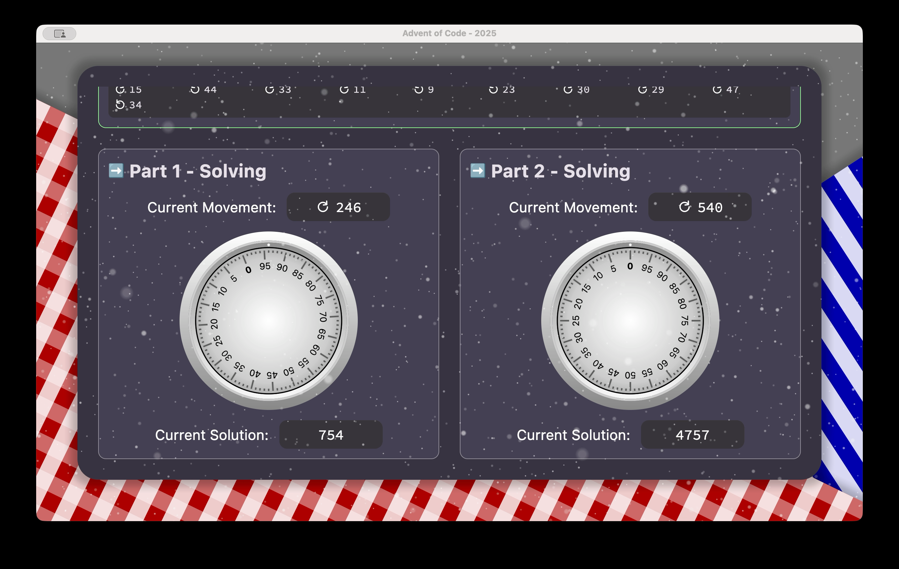</a></td>
        <td style="text-align: center; vertical-align: middle;"><a href="https://youtu.be/EcsqpXGhUVY" rel="nofollow">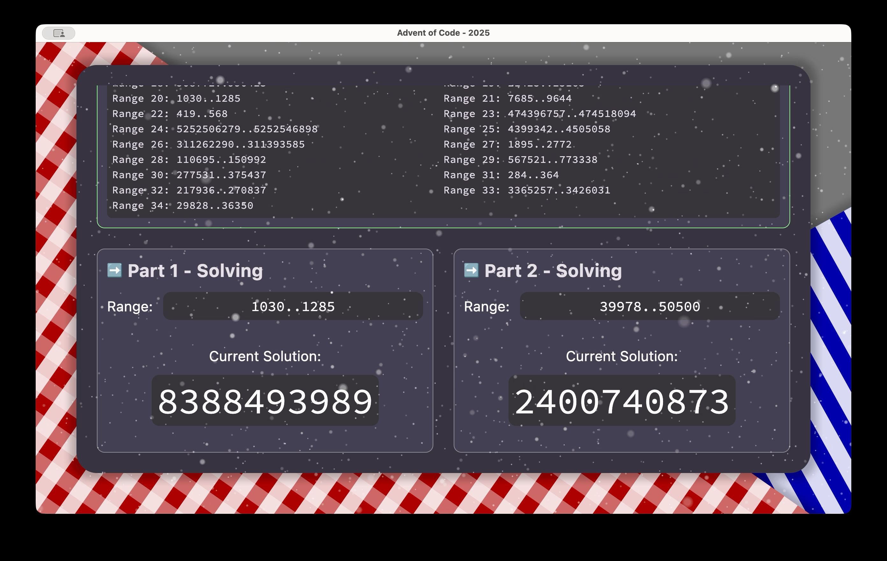</a></td>
    </tr>
    <tr>
        <td style="text-align: center; vertical-align: middle;">Day03</td>
        <td style="text-align: center; vertical-align: middle;">Day04</td>
    </tr>
    <tr>
        <td style="text-align: center; vertical-align: middle;"><a href="https://youtu.be/I3R6pfGu6eg" rel="nofollow">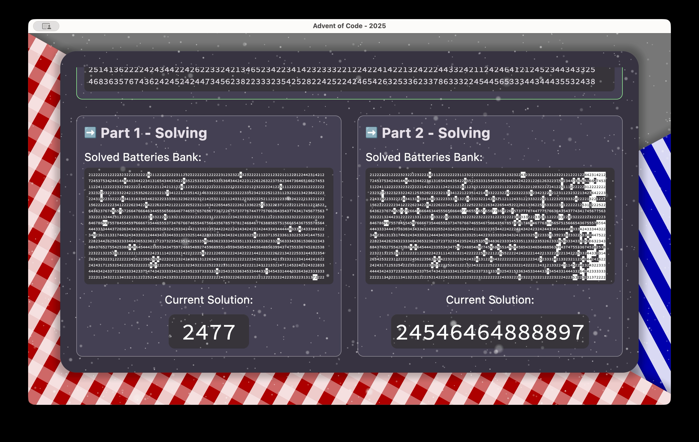</a></td>
        <td style="text-align: center; vertical-align: middle;"><a href="https://youtu.be/FBO87uTnQMc" rel="nofollow">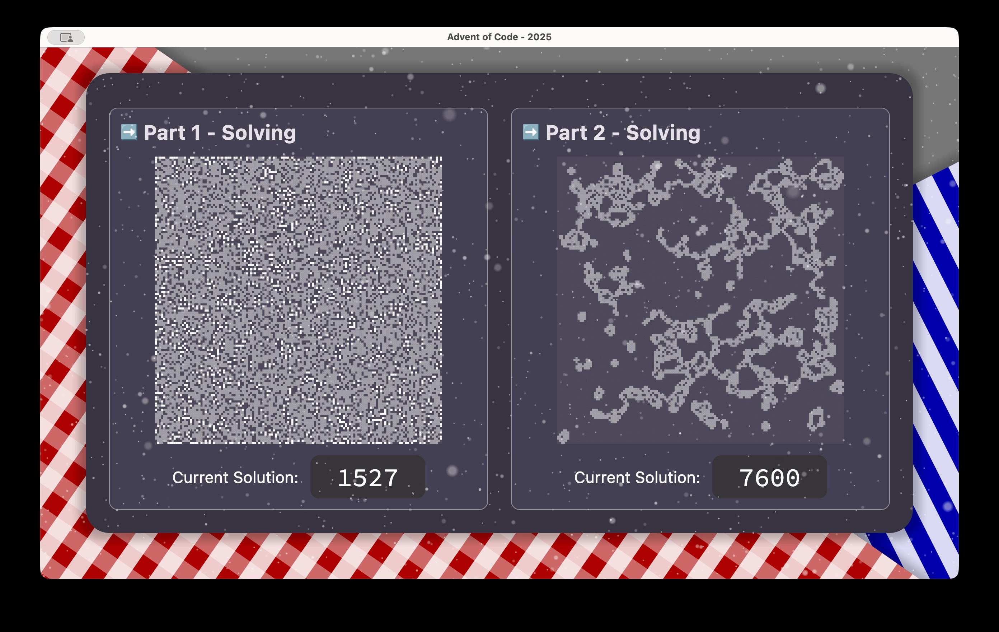</a></td>
    </tr>
    <tr>
        <td style="text-align: center; vertical-align: middle;">Day05</td>
        <td style="text-align: center; vertical-align: middle;">Day06</td>
    </tr>
    <tr>
        <td style="text-align: center; vertical-align: middle;"></td>
        <td style="text-align: center; vertical-align: middle;"><a href="https://youtu.be/OGaXx32cTIs" rel="nofollow">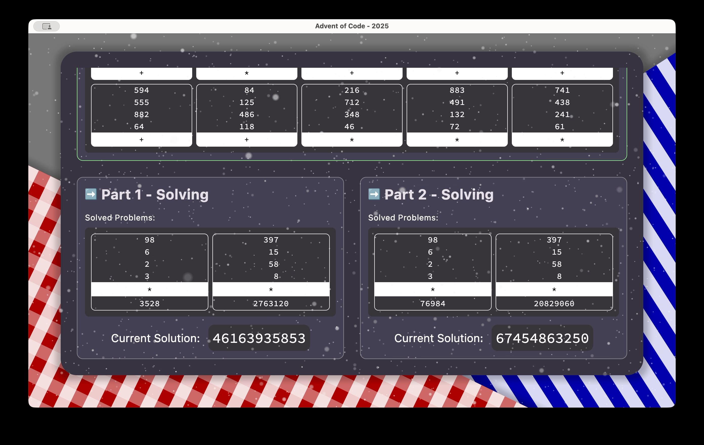</a></td>
    </tr>
    <tr>
        <td style="text-align: center; vertical-align: middle;">Day07</td>
        <td style="text-align: center; vertical-align: middle;">Day08</td>
    </tr>
    <tr>
        <td style="text-align: center; vertical-align: middle;"><a href="https://youtu.be/3BLwvwXJfRw" rel="nofollow">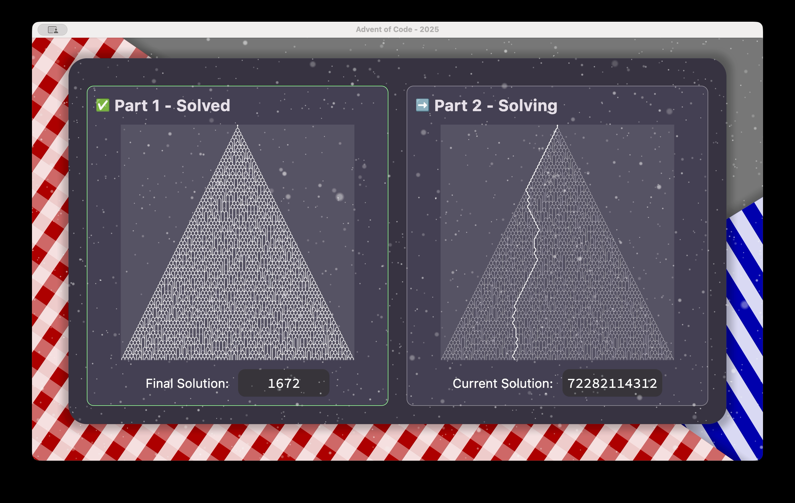</a></td>
        <td style="text-align: center; vertical-align: middle;"><a href="https://youtu.be/lLSCjTU2pL8" rel="nofollow">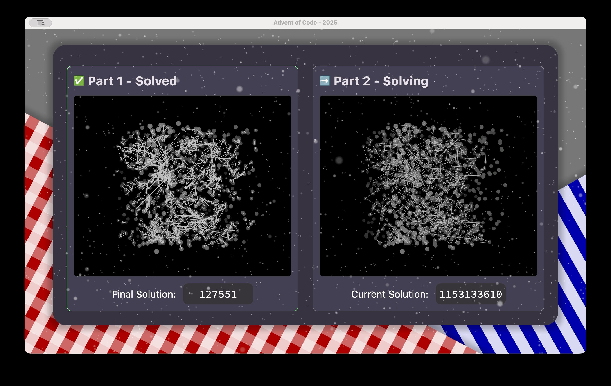</a></td>
    </tr>
    <tr>
        <td style="text-align: center; vertical-align: middle;">Day09</td>
        <td style="text-align: center; vertical-align: middle;">Day10</td>
    </tr>
    <tr>
        <td style="text-align: center; vertical-align: middle;"><a href="https://youtu.be/mz4HkJZujJE" rel="nofollow">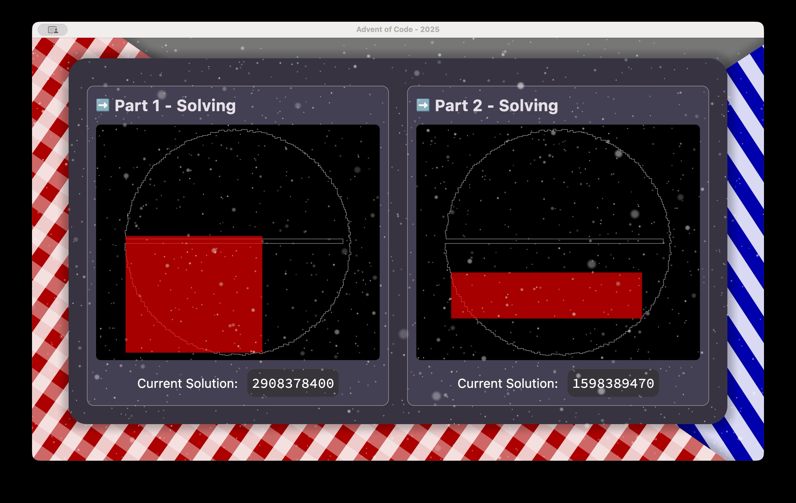</a></td>
        <td style="text-align: center; vertical-align: middle;"><a href="https://youtu.be/9vHnEIRsopk" rel="nofollow">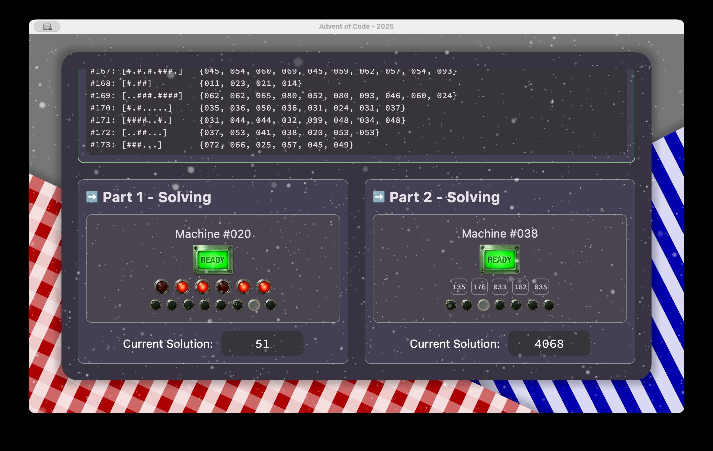</a></td>
    </tr>
    <tr>
        <td style="text-align: center; vertical-align: middle;">Day11</td>
        <td style="text-align: center; vertical-align: middle;">Day12</td>
    </tr>
    <tr>
        <td style="text-align: center; vertical-align: middle;"><a href="https://youtu.be/mz4HkJZujJE" rel="nofollow">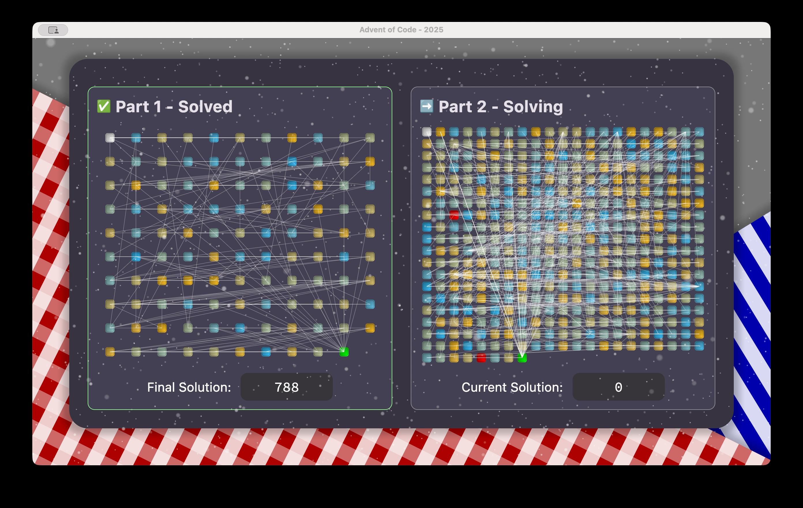</a></td>
        <td style="text-align: center; vertical-align: middle;"><a href="https://youtu.be/9vHnEIRsopk" rel="nofollow">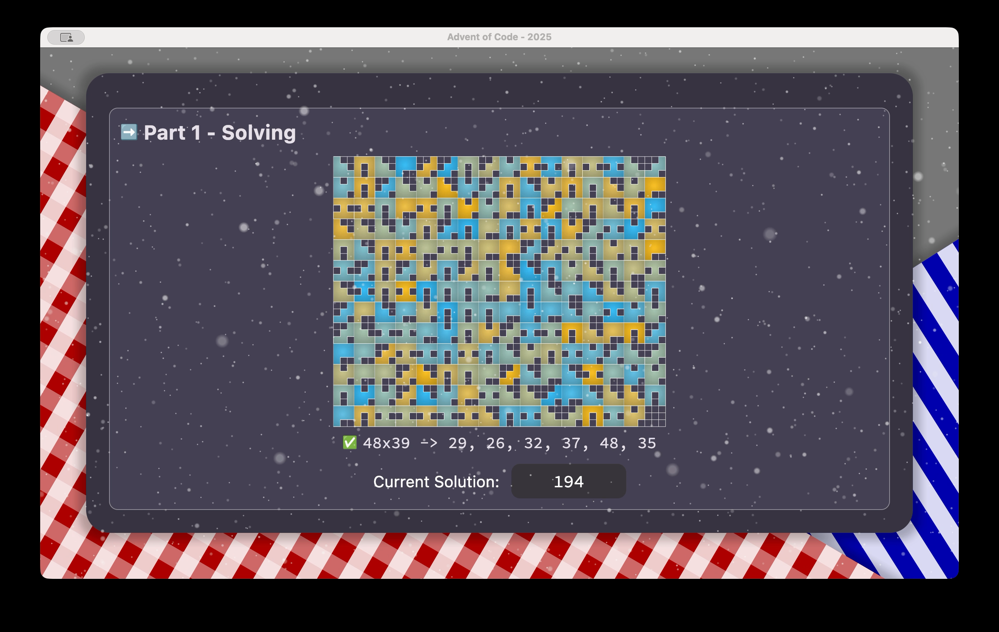</a></td>
    </tr>
  </tbody>
</table>

# 🙌 Credits

Advent of Code by Eric Wastl: https://adventofcode.com/

Solution for some days has been inspired by Marcin Wisniowski (@Nohus) and his awesome solutions [here](https://github.com/Nohus/AdventofCode2025).